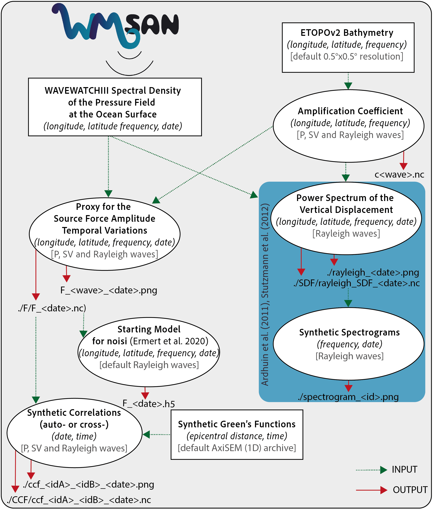

# WWSAN Python Package

## Description
This package is built to help computation of seismic ambient noise source maps and other products based on the WAVEWATCHIII hindcast output.

## Contents
```
ww3-source-maps/
|-- LICENSE
|-- pyproject.toml
|-- README.md
|-- src/
│   └── wwsan/
│       ├── readWW31.py
│       ├── read_hs_p2l.py
│       ├── subfunctions_body_waves.py
│       ├── subfunctions_rayleigh_waves.py
│       └── synthetics.py
|
|-- notebooks/
|   └── body_waves/
│       ├── amplification_coeff.ipynb
│       └── microseismic_sources.ipynb 
│   └── rayleigh_waves/
│       ├── amplification_coeff.ipynb
│       ├── microseismic_sources.ipynb
│       ├── spectrograms.ipynb
│       ├── rayleigh_source.ipynb
│       └── spectrograms.ipynb    
|-- data/
│   ├── C.nc
│   ├── cP.nc
│   ├── cS.nc
│   ├── longuet_higgins.txt
│   ├── stations_pair.txt
│   └── ww3.07121700.dpt
```
- src/ : contains all Python scripts and subfunctions.
- notebooks/ : contains Jupyter Notebooks with detailed examples on how to use this package. Rayleigh waves and body waves are separated.
- data/ contains additional files used in computation.

## Installation
The package will soon be available on [PyPI](https://pypi.org/).

In the meantime, you can follow the next steps:
1. Clone the repository 
``` 
cd path_to_your_wwsan_directory/
git clone https://gricad-gitlab.univ-grenoble-alpes.fr/tomasetl/ww3-source-maps.git 
cd ww3-source-maps/
````
2. Create an environment and install 
- if you use [Conda](https://docs.anaconda.com/free/miniconda/#quick-command-line-install) environments:
```
conda create --name wwsan 
conda activate wwsan
conda install pip
pip install .
```
to deactivate your environment:
```
conda deactivate
```

- otherwise
```
python3 -m venv venv
source venv/bin/activate
python3 -m pip install .
```
to deactivate your environment:
```
deactivate
```

### Dependencies
- [numpy](https://numpy.org/doc/stable/)
- [matplotlib](https://matplotlib.org/stable/)
- [cartopy](https://scitools.org.uk/cartopy/docs/latest/index.html)
- [xarray](https://docs.xarray.dev/en/stable/)
- [netCDF4](https://unidata.github.io/netcdf4-python/)
- [obspy](https://docs.obspy.org/)
- [datetime](https://docs.python.org/3/library/datetime.html)
- [scipy](https://scipy.org/)
- [pandas](https://pandas.pydata.org/pandas-docs/version/2.1.4/index.html)
- [dask](https://www.dask.org/)
- [ipykernel](https://pypi.org/project/ipykernel/)

# Documentation
Documentation still under construction. Please refer to the Jupyter Notebooks for details on theory and how to use this repo.

## Architecture of WWSAN Python Package


