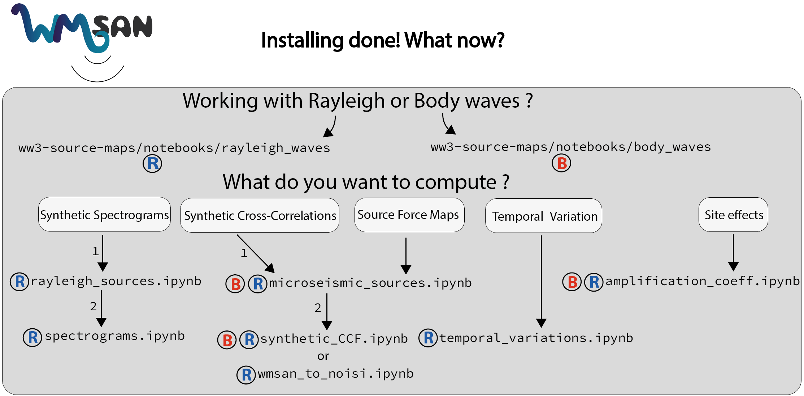

# Tutorials

 

Welcome to the tutorial section. Here you will find examples in the form of Jupyter notebooks that you can either download from the [GitLab repository](https://gricad-gitlab.univ-grenoble-alpes.fr/tomasetl/ww3-source-maps/-/issues) or this documentation website.

Please keep the architecture as follow:

    your_wmsan_dir/
    |-- notebooks/
    |   └── body_waves/
    │       ├── amplification_coeff.ipynb
    │       └── microseismic_sources.ipynb 
    │   └── rayleigh_waves/
    │       ├── amplification_coeff.ipynb
    │       ├── microseismic_sources.ipynb
    │       ├── spectrograms.ipynb
    │       ├── rayleigh_source.ipynb
    │       └── synthetic_CCF.ipynb
    │       └── wmsan_to_noisi.ipynb
    │       └── temporal_variations.ipynb
    |-- data/
    │   ├── C.nc
    │   ├── cP.nc
    │   ├── cS.nc
    │   ├── longuet_higgins.txt
    │   ├── stations_pair.txt
    │   └── ww3.07121700.dpt

Additionnal files can be found on the [GitLab repository](https://gricad-gitlab.univ-grenoble-alpes.fr/tomasetl/ww3-source-maps/-/issues) except for synthetic cross-correlations [AxiSEM](http://seis.earth.ox.ac.uk/axisem/) archive which is hosted on [Zenodo](https://zenodo.org/records/11126562).

## Site Effect - Amplification Coefficients

Secondary microseisms generation results from the interaction of oceanic waves of similar periods travelling in opposite directions, see [SANS](https://sans.ethz.ch/science/). When the resulting standing pressure field hits the seafloor interface, seismic waves can be emitted and travelling through the crust. Therefore the bathymetry and frequency content at source location has an impact on observed seismic waves. Site effect or amplification coefficient allow to quantify this transmition to the crust.

[Rayleigh Waves](notebooks/rayleigh_waves/amplification_coeff.ipynb){: .btn}
[Body Waves](notebooks/body_waves/amplification_coeff.ipynb){: .btn}

## Proxy for the Source Force - Source Maps

Once the site effect is quantified, let's make source distribution maps based on the WW3 outputs which can be compared to seismic data based source maps (e.g., [SANS](https://sans.ethz.ch/science/), backprojection, ...).

[Rayleigh Waves](notebooks/rayleigh_waves/microseismic_sources.ipynb){: .btn}
[Body Waves](notebooks/body_waves/microseismic_sources.ipynb){: .btn}

## Temporal Variations
If you want to see the temporal evolution of the source intensity in a specific area check out this example (dv/v series comparison, clustering occurence, ...).

[Rayleigh Waves](notebooks/rayleigh_waves/temporal_variations.ipynb){: .btn}
[Body Waves](notebooks/body_waves/temporal_variations.ipynb){: .bn}

## Synthetic Cross-correlation Functions
To compute synthetic cross-correlations with a WW3 model based source distribution.

[Rayleigh Waves](notebooks/rayleigh_waves/synthetic_CCF.ipynb){: .btn}

[Auto-Correlation](notebooks/rayleigh_waves/synthetic_CCF_autocorr.ipynb){: .bn}

[Body Waves](notebooks/body_waves/synthetic_CCF.ipynb){: .btn}

## WMSAN to noisi
To use the Proxy for the Source Force as a starting model for [noisi](https://github.com/lermert/noisi).

[Rayleigh Waves](notebooks/rayleigh_waves/wmsan_to_noisi.ipynb){: .btn}

## Synthetic Spectrograms
To compute synthetic spectrograms, following an example from [Ardhuin et al. (2011)](https://agupubs.onlinelibrary.wiley.com/doi/full/10.1029/2011JC006952) and using a data comparison from [Stutzmann et al. (2012)](https://academic.oup.com/gji/article/191/2/707/644255).

[Power Spectrum of Vertical Displacement](notebooks/rayleigh_waves/rayleigh_source.ipynb){: .btn}
[Spectrograms](notebooks/rayleigh_waves/spectrograms.ipynb){: .btn}